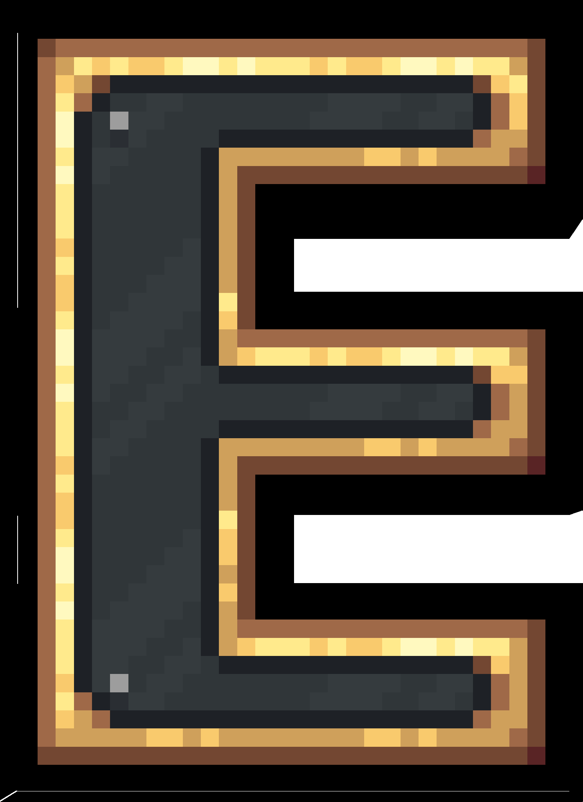

Sure, I can help you create a 

README.md

 for your project. Here's a basic template:

```markdown


<p align="center"></p>

<h1 align="center">Eldoria</h1>

<em><h5 align="center">(formerly Electron Launcher and Helioscord)</h5></em>

[<p align="center">](https://github.com/eraxium/Eldoria/actions) [](https://github.com/eraxium/Eldoria) </p>

<p align="center">un launcher utilisable partout.</p>

## Table of Contents

- [About](#about)
- [Features](#features)
- [Installation](#installation)
- [Usage](#usage)
- [Contributing](#contributing)
- [License](#license)

## About

Eldoria is a versatile launcher that can be used anywhere. It is a continuation of the Electron Launcher and Helioscord projects.

## Features

- Easy to use
- Cross-platform compatibility
- Lightweight and fast
- Customizable

## Installation

To install Eldoria, follow these steps:

1. Clone the repository:
    ```sh
    git clone https://github.com/eraxium/Eldoria.git
    ```
2. Navigate to the project directory:
    ```sh
    cd Eldoria
    ```
3. Install the dependencies:
    ```sh
    npm install
    ```

## Usage

To start using Eldoria, run the following command:
```sh
npm start
```

## Contributing

Contributions are welcome! Please read the contributing guidelines first.

## License

This project is licensed under the MIT License. See the LICENSE file for details.
